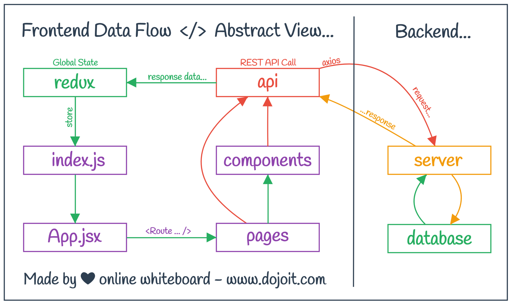

> 23 - Nov - 2022

# Mini Social Media MERN App | [Live Link](https://mini-social-media-bd.netlify.app)

## Frontend | lib used...
1. React
2. Material UI
3. Redux Toolkit
4. Redux Persist
5. React Dropzone
6. Formik
7. Yup
8. Axios

## Backend | lib used...
01. Express
02. Nodemon
03. Dotenv
04. Bcrypt
05. Cors
06. Helmet
07. Body Parser
08. GridFs Stream
09. Json Web Token
10. Mongoose
11. Morgan
12. Multer
13. Multer GridFs Storage

 

## ReactJs | Frontend Basic Data Flow...

 

## NodeJs | Backend Basic Data Flow...

 

## Database Table Relationship...

 

## JWT System

<!-- 
https://github.com/ed-roh/mern-social-media
-->